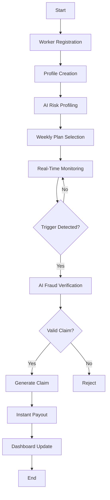

# TechTitans

# InSureGo: Real-Time Income Protection for Delivery Partners

Delivery partners in India's gig economy rely on per-order earnings rather than fixed salaries. A typical delivery worker completes 18–25 deliveries per day, earning around ₹500–₹900 daily depending on demand and incentives.

However, their income is highly vulnerable to external disruptions such as heavy rainfall, floods, extreme heat, air pollution, or local restrictions. During such events, deliveries may drop significantly, reducing daily income to ₹200–₹300 and causing losses of ₹400–₹600 per day.

Currently, most gig workers do not have income protection against these uncontrollable disruptions. As a result, even short interruptions can significantly impact their weekly earnings.

This creates a need for an AI-powered parametric insurance platform that can detect disruptions in real time and provide automated compensation for lost income.

## Requirement Analysis & Solution Design

### 1. Persona Identification

Our primary users are food delivery partners working on platforms like Zomato and Swiggy. These workers are part of the gig economy and depend on daily deliveries for income.

####  Typical profile:
 

* Works 8–10 hours/day
* Completes 18–25 deliveries/day
* Earns ₹500–₹900/day
* Receives weekly payouts
* Has no fixed salary or income guarantee

Their earnings are highly sensitive to external disruptions such as weather, pollution, or local restrictions.

### 2. Persona-Based Scenario

#### Scenario 1: Zomato Delivery Partner (Heavy Rainfall)

Name: Rahul

Platform: Zomato

City: Kolkata

Rahul usually completes 20+ deliveries per day, earning around ₹700 daily.

#### On a day with heavy rainfall (>45mm):

* Orders drop significantly
* Roads become unsafe
* Rahul completes only 6–8 deliveries

Income drops to: ₹250–₹300
Loss: ₹400–₹450 in a single day

Rahul has no way to recover this loss, even though it was caused by external conditions.

### 3. Key Requirements
From these scenarios, the system must:

* Provide *income protection for gig workers*
* Detect *external disruptions automatically*
* Enable *weekly micro-insurance plans*
* Trigger *instant compensation without manual claims*
* Ensure *fraud prevention using AI*
* Be *simple, fast, and accessible*

### 4. Application Workflow

The system operates through a structured pipeline:

This workflow ensures that:

* Disruptions are detected *in real time*
* Claims are *automatically processed*
* Workers receive *fast and transparent compensation*

### 5. Outcome

The system creates a *financial safety net* for delivery partners by:

* Reducing income uncertainty
* Providing instant relief during disruptions
* Strengthening trust in gig-based work systems

This makes the solution *scalable, impactful, and aligned with real-world needs of delivery workers*.

## Tech Stack

Our platform uses a modern and scalable technology stack to build an AI-powered parametric insurance system for gig workers.

### Frontend

* **React.js** – For building a fast and responsive web interface
* **Tailwind CSS** – For modern and clean UI design
* **Chart.js** – For visualizing analytics and disruption data

### Backend

* **Node.js** – Server-side runtime environment
* **Express.js** – REST API development and routing

### Database

* **MongoDB** – Stores user profiles, insurance plans, claims, and disruption data

### AI / Machine Learning

* **Python** – Model development and data processing
* **TensorFlow / PyTorch** – Training disruption prediction models
* **Scikit-learn** – Fraud detection and risk scoring models

### External APIs

* **OpenWeather API** – Real-time weather monitoring
* **AQI API** – Air quality index data for pollution detection
* **Google Maps API** – Location tracking and geo-validation

### Deployment & DevOps

* **Docker** – Containerized application deployment
* **AWS / Vercel** – Cloud hosting and scalability
* **GitHub Actions** – Continuous integration and automated workflows

<a href="#top">⬆️ Back to Top</a>

